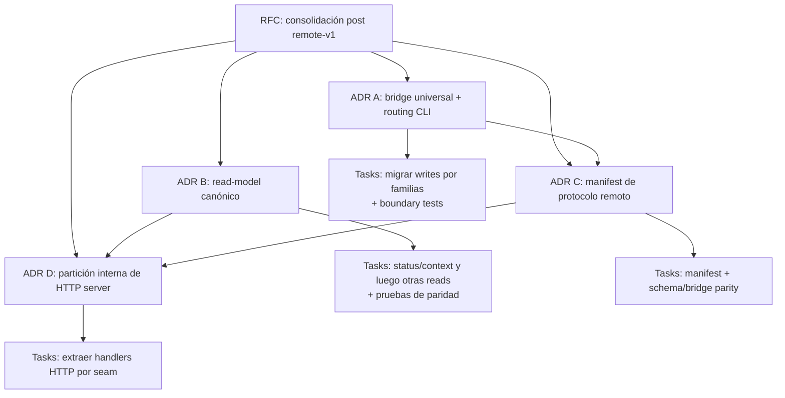

# RFC: consolidar arquitectura post remote-v1

- Gate: `G-remote-architecture-refactor-rfc` · Iniciativa: `remote-architecture-refactor` · Estado: aprobado
- Autor: orchestrator · Fecha: 2026-09-26
- Base: `feat/remote-backend-rfc` tras la aceptación de remote v1

## Problema

Remote v1 cerró el producto con servidor autoritativo, bridge local/remoto,
API HTTP tipada, ledger/fence v5, transferencias básicas y E2E local. La
semántica de dominio, transacción y persistencia sigue centralizada en
providers, kernel y storage, por lo que no existe una segunda fuente de verdad
remota.

Sin embargo, el crecimiento dejó duplicación de adaptación en los perímetros:
algunos comandos CLI aún construyen la ruta local directamente mientras la ruta
remota usa el bridge; los helpers de routing remoto se solapan; CLI y HTTP
arman versiones paralelas de las vistas `status` y `context`; y el catálogo de
operaciones se mantiene en varios allowlists y schemas. Esto incrementa el
riesgo de que una operación nueva tenga paridad local/remota incompleta, un
schema HTTP desalineado o una proyección pública divergente.

El problema es de mantenibilidad y evolución, no un defecto conocido de
seguridad ni de autoridad de remote v1. El refactor debe conservar los
contratos públicos existentes y no reabrir el release remoto.

## Objetivos

1. Hacer que el bridge sea el único punto de entrada de las writes CLI
   ordinarias respaldadas por providers, tanto locales como remotas.
2. Definir explícitamente las excepciones de state y transferencia (`init`,
   `restore`, `push`, `pull`) antes de decidir si alguna puede migrar al bridge.
3. Consolidar el routing interno de operaciones CLI para reducir selección
   duplicada por dominio, target y revisión.
4. Establecer proyecciones puras compartidas para lecturas, empezando por
   `status` y `context`, consumibles por CLI y HTTP con un reloj inyectable.
5. Reducir fuentes manuales de verdad de la superficie remota mediante un
   manifiesto estático de protocolo, sin relajar la validación hostil del
   servidor ni confundir capacidades remotas con el catálogo canónico.
6. Mantener `server/http.mjs` como fachada pública estable mientras se reduce
   su tamaño por seams ya existentes.
7. Reforzar tests de boundary/import para impedir que nuevos adapters mutantes
   vuelvan a importar kernel, providers, policy o storage directamente.

## No objetivos

- Cambiar comandos, flags, envelopes JSON, códigos de error o state schema.
- Cambiar semántica de lifecycle, policy, providers, kernel, ledger o locking.
- Cambiar el protocolo remote v1, autenticación bearer, origin binding o
  catálogo server-side.
- Añadir sync, merge, cache offline, journal, retry automático, transfer-status
  o CAS de overwrite.
- Exponer plugins, UI, snapshots o restore como capacidades remotas.
- Reescribir todo `src/server/http.mjs`, todos los comandos, o extraer una
  plataforma/framework nuevo en una sola entrega.

## Principios e invariantes

### Dirección de dependencias

La dirección vigente se conserva:

```text
CLI / Server / Plugins
        -> application
        -> providers
        -> kernel
        -> storage
```

- `kernel`, `providers` y `read-model` no importan adapters.
- Los adapters mutantes no importan `storage` ni persisten directamente. Los
  adapters de lectura pueden cargar un snapshot mediante un seam de lectura
  explícito mientras las proyecciones puras permanecen fuera de ellos.
- Los comandos built-in ordinarios nuevos no importan providers,
  `kernel/mutate` ni `plugins/policy`; pasan por Application Operations mediante
  el bridge. `init`, `restore`, `push` y `pull` son excepciones declaradas hasta
  que ADR A decida su boundary; no quedan incluidos implícitamente en “todas las
  writes”.
- El servidor sigue siendo un adapter: valida HTTP/auth/catálogo y ejecuta el
  mismo catálogo de operaciones canónicas.

### Autoridad remota

Con backend remoto, el switch ocurre antes de cargar policy local, metadata,
plugins, kernel o storage del cliente. Errores de auth, protocolo o red no
hacen fallback local. El refactor debe conservar esta propiedad y sus tests de
sentinel local.

### Compatibilidad observable

Cada slice preserva el resultado público actual para una matriz local/remota:

- envelopes y códigos de error del CLI;
- orden de policy, validación, revisiones y log;
- schema HTTP, allowlist y rechazo de campos desconocidos;
- operaciones permitidas/no soportadas remotamente;
- respuesta de `status`, `context`, `search`, `initiatives` y `log`;
- llamadas de plugins que sean parte de la API actual.

No se aceptan tests que cambien expectativas solo para acomodar un refactor sin
una demostración de que la expectativa anterior contradice el contrato público.

## Propuesta recomendada

Ejecutar un refactor incremental en cuatro decisiones técnicas, con tests de
paridad después de cada una. Cada decisión debe tener ADR y tasks con paths
exclusivos; no se ejecutan dos workers sobre el mismo adapter o módulo
compartido.

### A. Universalizar Application Operations y el bridge para writes ordinarias

Migrar los comandos built-in ordinarios que aún construyen la mutación local
directamente al bridge local/remoto. El adapter conserva:

- parsing argv;
- normalización específica de CLI;
- actor;
- defaults públicos y envelope de respuesta;
- wrappers de compatibilidad ya observables, solo cuando estén explícitamente
  modelados y cubiertos por tests.

Antes de migrar el primer comando, ADR A define un **composition root local**
único para el bridge: construye registry, `mutate`, selección de policy y
autorización exactamente una vez para la ejecución local de `runCli`. El bridge
nunca recibe un `source` opcional que pueda llegar incompleto a
`executeOperation`.

La metadata de operación puede declarar un override de acción de policy cuando
la compatibilidad lo requiere. Ejemplo obligatorio: `take` debe conservar la
distinción entre `task.take` y el takeover autorizado como `task.takeover`; no
se acepta cambiar ese seam solo para unificar imports.

El bridge conserva una sola delegación:

```text
local  -> executeOperation / executeBatch con source completo
remote -> backendClient.executeOperation / executeBatch
```

`init`, `restore`, `push` y `pull` no entran en esta migración por defecto:
son operaciones state/transfer con dos extremos o lifecycle especial. ADR A
inventaría para cada una owner, paths, contrato y prueba antes de decidir si
sigue como excepción explícita o recibe un boundary propio.

Las slices de migración se enumeran y serializan por paths compartidos:

1. foundation local source + test de boundary;
2. task lifecycle (`take`, `release`, `submit`, `accept`, `reject`, `resolve`,
   `reopen`, `cancel`), con `takeover` cubierto;
3. creación/actualización multi-kind (`add-task`, `add-gate`,
   `add-knowledge`, `add-node`, `update`);
4. initiative, note, edges y knowledge writes (`add-initiative`, `add-note`,
   `add-edge`, `remove-edge`, `deprecate-knowledge`);
5. batch y excepciones declaradas, solo si el inventario muestra un cambio
   seguro.

El inventario completo de comandos por slice vive en ADR-029; esta lista es la
enumeración resumida y no reemplaza ese inventario.

Cada familia define su matriz local/remota de operation ID, input, policy
acción, envelope, error, log y state; además prueba que la ruta local atraviesa
el bridge. Se mantiene un allowlist temporal, versionado y decreciente de
excepciones legacy en el test de imports.

### B. Consolidar el routing de operaciones CLI

Reemplazar los helpers paralelos de `src/cli/commands/internal/` por un router
interno declarativo. Su metadata es exclusivamente de adaptación CLI:

- discriminador de target/pre-read cuando aplique;
- selección por subkind (`task` frente a `gate`);
- estrategia de `if_revision`, es decir la regla de selección/población de la
  revisión esperada (el manifiesto solo declara el campo wire HTTP);
- input resultante sin actor;
- localizador de entidad en la respuesta;
- override de acción de policy previamente declarado por ADR-029.

El router **no** es dueño del operation ID canónico, schema HTTP o capacidades
del backend remoto. Resuelve el comando CLI contra el operation ID del catálogo
canónico y es owner exclusivo de la metadata de adaptación CLI; el backend
remoto consulta la proyección remote-v1 definida en ADR-031 al ejecutar. El router
no contiene reglas de dominio ni ejecuta storage. Sus comandos siguen siendo
interpretados por los adapters CLI antes de que el router traduzca input,
target y resultado; así se elimina selección repetida sin mover parsing argv.

### C. Canonicalizar las proyecciones de lectura

Ampliar `read-model/` o introducir `application/queries/` como módulo puro que
sea dueño de las vistas canónicas. La recomendación inicial es mantener el
nombre `read-model/` y añadir composiciones como:

```text
projectStatusView(snapshot, filters)
projectContextView(snapshot, id, options)
projectSearchView(snapshot, query, options)
projectInitiativesView(snapshot, options)
projectLogView(snapshot, filters)
```

CLI y HTTP conservan parsing, carga del snapshot mediante un seam explícito y
envelopes de transporte; solo dejan de armar reglas de presentación por
separado. La primera slice es `status` y `context`, porque tienen mayor
contenido derivado. Las proyecciones reciben `now` numérico (epoch ms), muestreado una sola vez por
request en cada adapter, para que edad de claim, stale y alerts se prueben
exactamente en CLI y HTTP sin una llamada interna a `Date.now()`. Cada extracción
se protege con fixtures compartidas y pruebas de paridad, incluyendo los
contratos existentes de status/context y handlers HTTP. Las vistas plugin/UI
mantienen sus DTOs y consumidores propios salvo delegación de subprojections con
semántica idéntica; ADR-030 define esas fronteras y evita declarar como canónica
una vista que conserva reglas diferentes.

### D. Manifest y partición interna del protocolo HTTP

Mantener como única fuente de operación canónica el catálogo built-in existente.
Crear junto a él un manifiesto estático, data-only y versionado que sea una
**proyección exclusiva de capacidades remote-v1**, no un nuevo catálogo general:

- operation ID ya existente en el catálogo canónico;
- campos superficiales permitidos por HTTP;
- elegibilidad en batch remoto.

El manifiesto no duplica metadata de adaptación CLI (target/pre-read, regla de
selección/población de `if_revision` ni localizador de resultado), que pertenece
al router definido en ADR A. El manifiesto solo declara `if_revision`, cuando
aplique, como campo wire HTTP superficial; la regla que decide cómo se selecciona
y puebla la revisión esperada es exclusivamente del router. Las pruebas de
paridad relacionan ambos owners por operation ID.

El servidor deriva su allowlist y validación superficial desde la proyección
remote-v1, pero conserva validación profunda de JSON hostil, auth/scope/catálogo
y validación semántica del provider. El backend remoto deriva sus IDs soportados
desde la misma proyección. El backend local y el bridge compartido continúan
aceptando el catálogo canónico completo: capacidades válidas solo locales no se
pierden por no formar parte de remote v1. `cli/dispatch` conserva su allowlist
de comandos porque es una superficie distinta, pero se prueba contra la
proyección de capacidades correspondiente.

Una vez estable el manifiesto y las queries, dividir internamente
`src/server/http.mjs` sin cambiar su export público ni reemplazar el servidor
stdlib `node:http`. La estructura objetivo es:

```text
src/server/
  http.mjs                 # createRemoteApiServer / composition root
  http/
    codec.mjs              # HTTP errors, envelopes, headers, JSON y path decoding
    operations.mjs         # validación/schema HTTP y dispatch de operaciones/batch
    reads.mjs              # routing/query parsing y proyecciones HTTP sobre read-model
    transfers.mjs          # validación tipada y llamadas a kernel transfer ports
```

`http.mjs` permanece como composition root y conserva `createRemoteApiServer`
y `PROTOCOL_VERSION` en el mismo import path público. Sigue creando el servidor,
coordinando el ciclo común del request, conectando auth/scope/catálogo, inyectando
registry/mutate/policy, resolviendo init y serializando errores no capturados.
Los módulos extraídos no crearán otro servidor ni leerán configuración global.

### Responsabilidad por módulo

- **`codec.mjs`** contiene helpers de transporte puros: construcción/mapeo de
  errores HTTP, `jsonError`, respuesta JSON/headers, decodificación del path,
  validación de Content-Type, límite de bytes y parseo de body. Códigos, mensajes,
  status, protocol header, `cache-control` y envelopes permanecen idénticos.
  `PROTOCOL_VERSION` se define una sola vez y sigue exportado por `http.mjs`; la
  fachada pasa su valor explícitamente a los helpers que construyen headers. El
  codec no importa la fachada ni duplica el literal de versión.
- **`operations.mjs`** contiene validación superficial del request de
  operación/batch y despacho hacia `executeOperation`/`executeBatch`. Recibe el
  `source` completo desde la fachada; no carga policy ni crea un registry por su
  cuenta. Cuando ADR C exista, sus allowlists/campos proceden de la proyección
  remote-v1, nunca de un segundo catálogo general.
- **`reads.mjs`** contiene matching/parsing de rutas de lectura y armado de
  resultados HTTP. Recibe snapshot, route, query y clock/dependencias explícitas;
  no lee storage ni crea servidor. Las reglas canónicas de `status` y `context`
  vienen del read-model definido en ADR-030; el módulo solo conserva adaptación de
  query/DTO HTTP.
- **`transfers.mjs`** valida el payload tipado de export/import y delega a
  `captureTransferSource` / `installTransferDestination` en
  `kernel/transfer.mjs`. No importa `storage/`, reconstruye auditoría ni maneja
  filesystem.

### Secuencia observable que no debe cambiar

La fachada conserva el orden actual del request, porque evita abrir storage
para requests malformados y autentica antes de ejecutar handlers:

```text
parsear URL, versión y ruta
  -> parsear/validar body o query según la ruta
  -> validar bearer, scope y proyecto en catálogo
  -> abrir/provisionar el proyecto autorizado
  -> ejecutar handler de init, operación, transferencia o lectura
  -> serializar respuesta o error
```

La extracción no mueve las comprobaciones de body/query detrás de
`withAuthorizedProject`, no abre el proyecto desde un módulo helper y no cambia
qué actor, projectDir o hooks inyectados recibe cada handler. Auth/scope sigue
ocurriendo antes de abrir o provisionar state, ledger y lock.

### Orden de implementación y verificación

La fachada es un path compartido, así que las slices se implementan en serie:

1. Caracterizar `createRemoteApiServer`, `PROTOCOL_VERSION`, envelopes, errores y
   que requests inválidos no llamen auth/opener.
2. Extraer codec y mantener re-export de `PROTOCOL_VERSION`.
3. Extraer transfer validation/dispatch y añadir una regla/test de imports
   acotado a `src/server/http/`: los módulos extraídos no importan `storage/` y
   las transferencias pasan por los puertos de `kernel/transfer.mjs`. La regla no
   prohíbe `readState` desde `src/server/http.mjs`, que conserva el seam explícito
   de carga de snapshots; no se añade una prohibición global `server -> storage`.
   Mantener además tests funcionales HTTP para source activo, payload inválido y
   resultado de instalación.
4. Extraer operations después del manifiesto remote-v1; conservar schema estricto,
   inyección server-side y `core.batch`.
5. Extraer reads después del read-model canónico; conservar query parsing y
   paridad CLI/HTTP con el mismo snapshot y clock determinista.
6. Cerrar con la suite HTTP completa y una fachada sin implementaciones privadas
   duplicadas.

Por cada slice se corre `test/server-http.test.mjs` y el test de boundary
relevante. Las extracciones de reads añaden las suites de read-model,
`v2-context-contract` y `v2-status-history`; las de transfer cubren
`cli-transfer`, `kernel-transfer`, las rutas HTTP de transferencia en
`test/server-http.test.mjs` (donde viven hoy esos tests) y el flujo
server/remoto en `test/server-operations-e2e.test.mjs`. Al cerrar, corren además
`npm test`, `npm run test:concurrent`, `npm run pack:check` y
`git diff --check`. No se añaden frameworks, dependencias runtime ni tests de
nueva semántica bajo el pretexto de mover código.

La separación se hace por slices verificables; no se moverán rutas no cubiertas
por tests de protocolo y paridad.

### Política de adopción de Oxlint

`.oxlintrc.json` y `npm run lint` se incorporan como tooling informativo, separado
de las decisiones de arquitectura y de la aceptación de los ADRs. Con Oxlint
1.85.0 sobre `src bin test`, el baseline observado es 2.231 errores (0
advertencias) en 281 archivos; por eso `npm run lint` termina actualmente con
código 1. CI ejecuta `npm test` y `npm run pack:check`, no lint. No se exige que
lint pase limpio, no se harán autofixes y no se corregirá la deuda existente
como parte de este RFC. Los ADRs conservan criterios de aceptación funcionales y
sus pruebas; el exit code de lint no bloquea su implementación ni validación.
Cualquier gate futuro o política automatizada de baseline/delta (incluido el
criterio para retirar el baseline) requiere una decisión separada; hasta
entonces no se implica un umbral de regresiones por archivos tocados.

## Secuencia propuesta

Leyenda letra ↔ ADR: A = ADR-029 (bridge universal + routing CLI), B =
ADR-030 (read-model canónico), C = ADR-031 (manifiesto remote-v1), D =
ADR-032 (partición interna de HTTP). El diagrama usa las letras; los gates de
decisión usan los números.



Las relaciones expresan dependencia de diseño, no autorizan implementar todas
las piezas juntas. En particular:

1. ADR A empieza por el composition root local, el inventario de excepciones y
   los boundary/parity tests antes de migrar una familia de comandos.
2. ADR B puede extraer queries puras en paralelo mientras no toque los mismos
   adapters que A; inyecta clock desde la primera slice.
3. ADR C espera conocer el resultado de A para no modelar excepciones legacy
   como superficie permanente y mantiene separadas capacidades local/remote.
4. ADR-032 espera ADR-030 y ADR-031. Además, las tasks deben ordenar la integración
   del manifiesto al server y su conformance antes de cualquier extracción sobre
   `src/server/http.mjs`; la dependencia entre gates de diseño no serializa por sí
   sola esas futuras ediciones compartidas.

## Alternativas consideradas

| Opción | Pros | Contras |
|---|---|---|
| No refactorizar | Cero costo inmediato; v1 está verde | Cada operación/lectura remota nueva amplifica drift en CLI, HTTP y schemas | 
| Reescritura total de CLI/server | Podría dejar un árbol ideal en una sola etapa | Alto riesgo de regresión; mezcla contratos, protocolo y persistencia; bloquea evolución | 
| Refactor incremental por boundaries — recomendada | Preserva contratos, reduce riesgo, permite validación por slice y rollback conceptual | Requiere disciplina temporal con allowlists y tests de paridad | 
| Extraer microservicios o paquetes nuevos | Separación física fuerte | Complejidad operativa sin valor para una CLI Node stdlib-only | 

## Riesgos y mitigaciones

| Riesgo | Mitigación |
|---|---|
| Un refactor cambia envelope, error o timing de policy | Matrices de parity local/remota y tests existentes antes/después de cada slice |
| El bridge universal cambia un comando legacy de forma sutil | Composition root local completo, override de policy declarado, migración por familia y comparación de respuesta pública |
| State/transfer operations se incorporan accidentalmente a una migración ordinaria | Inventario explícito de `init`/`restore`/`push`/`pull`; cada excepción tiene owner, paths y test antes de cualquier cambio |
| El manifiesto rebaja validación de HTTP o limita capacidades locales | Es una proyección remote-v1 del catálogo canónico; solo deriva allowlist/campos superficiales y el servidor mantiene auth, schema hostil y provider validation |
| Queries compartidas cambian vistas de UI o plugins | ADR-030 define owners/DTO por consumidor, `now` determinista y parity tests; solo los subprojections de semántica idéntica se delegan, antes de eliminar ensamblado duplicado |
| `server/http.mjs` se parte con conflictos grandes | Extraer un seam por task, mantener `createRemoteApiServer` estable y no mezclar movimientos con cambios de behavior |
| El alcance vuelve a tocar remote v1 | ADRs y tasks declaran explícitamente no-go: no auth/protocol/schema/state behavior nuevo salvo consolidación ya cubierta |

## Criterios de éxito

1. Ningún comando built-in ordinario nuevo importa kernel/provider/policy
   directamente; las excepciones legacy y state/transfer son explícitas, con
   owner/path/test y plan de eliminación o boundary definitivo.
2. Local y remoto usan el mismo bridge para todas las writes ordinarias; la
   matriz enumera por familia operation ID, input, policy acción, envelope,
   error, log y state en ambos modos.
3. Existe un owner puro compartido de status/context CLI/HTTP; ambos muestran la
   misma vista para snapshot, filtros, identidad y `now` equivalente. Las vistas
   UI/plugin conservan sus DTOs y semántica explícitamente fuera del alcance
   compartido, excepto subprojections delegadas con paridad demostrada.
4. Los operation IDs provider-backed conservan el catálogo canónico; el schema
   superficial remoto y las capacidades del cliente se derivan de la proyección
   remote-v1. El envelope compuesto `core.batch` se especifica aparte, no se
   registra como provider y conserva la elegibilidad actual sin nesting.
5. `server/http.mjs` conserva API pública pero deja de concentrar codec, reads,
   operaciones y transferencias en un único archivo.
6. `npm test`, concurrencia aplicable, matrices de routing/parity y
   `git diff --check` siguen verdes después de cada ADR y al cierre.

## Preguntas abiertas para ADRs derivados

1. ¿Qué boundary definitivo tendrán `init`, `restore`, `push` y `pull`? ADR-029
   recomienda inventariarlos primero y dejarlos como excepciones explícitas hasta
   que un seam compatible con sus invariantes se demuestre.
2. ¿Qué metadata exacta posee cada router CLI tras la inspección del código?
   ADR-029 la acota a traducción CLI y ADR-031 separa de ella schema/capacidad
   remote-v1; su revisión puede concretar names/paths sin superponer owners.
3. ¿Cómo representar batch si `core.batch` es un envelope compuesto y no un ID
   provider-backed del catálogo? ADR-031 lo modela como descriptor separado cuya
   elegibilidad deriva de sus entradas y prohíbe nesting.
4. ¿Qué subprojections de plugin pueden compartir implementación pura sin cambiar
   su DTO ni identidad, y qué reglas de status/claims UI siguen propias? ADR-030
   lo resuelve view por view; UI summary/stale permanece fuera de ownership
   compartido.

## ADRs derivados

- [x] ADR-029: bridge universal y routing declarativo de writes CLI → `.adrs/029-universal-cli-operation-bridge.md`
- [x] ADR-030: proyecciones de lectura canónicas compartidas → `.adrs/030-canonical-read-model-projections.md`
- [x] ADR-031: manifiesto de protocolo remote-v1 y paridad de schemas → `.adrs/031-remote-v1-capability-manifest.md`
- [x] ADR-032: composición modular del HTTP server → `.adrs/032-modular-http-server-facade.md`

Los ADRs y sus gates se crean como borradores derivados del RFC aprobado. Sus
relaciones de precedencia se mantienen explícitas en el DAG: ADR-031 queda
bloqueado por ADR-029; ADR-032 queda bloqueado por ADR-030 y ADR-031. No se
aprueban ADRs ni se crean tasks de implementación en esta fase.

## Verificación para la fase de diseño

- Review de arquitectura: dirección de imports, ownership de metadata y
  compatibilidad con providers/kernel/storage.
- Review de ejecución: tamaño de ADRs/tasks, exclusividad de paths, matrices de
  regression y secuencia sin big bang.
- Antes de resolver el RFC: ningún bloqueo abierto sobre contratos públicos,
  protocol security o la secuencia de migración.
