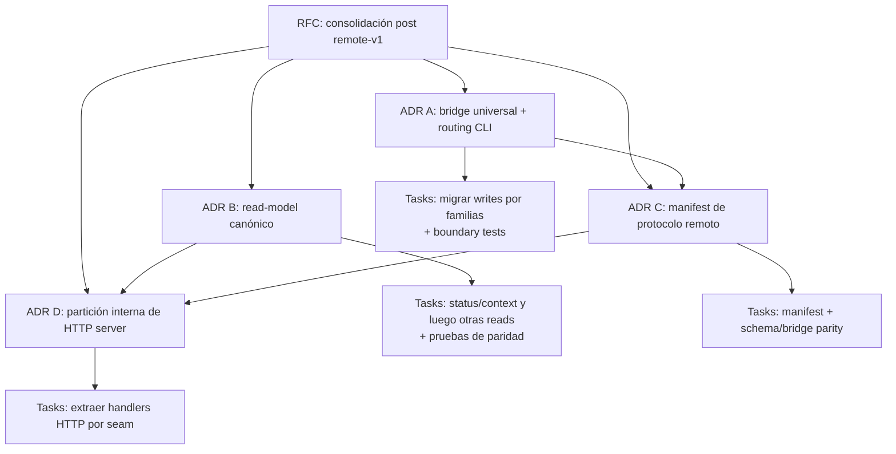

# RFC: consolidar arquitectura post remote-v1

- Gate: `G-remote-architecture-refactor-rfc` · Iniciativa: `remote-architecture-refactor` · Estado: borrador
- Autor: orchestrator · Fecha: 2026-09-25
- Base: `feat/remote-backend-rfc` tras la aceptación de remote v1

## Problema

Remote v1 cerró el producto con servidor autoritativo, bridge local/remoto,
API HTTP tipada, ledger/fence v5, transferencias básicas y E2E local. La
semántica de dominio, transacción y persistencia sigue centralizada en
providers, kernel y storage, por lo que no existe una segunda fuente de verdad
remota.

Sin embargo, el crecimiento dejó duplicación de adaptación en los perímetros:
algunos comandos CLI aún construyen la ruta local directamente mientras la ruta
remota usa el bridge; los helpers de routing remoto se solapan; CLI y HTTP
arman versiones paralelas de las vistas `status` y `context`; y el catálogo de
operaciones se mantiene en varios allowlists y schemas. Esto incrementa el
riesgo de que una operación nueva tenga paridad local/remota incompleta, un
schema HTTP desalineado o una proyección pública divergente.

El problema es de mantenibilidad y evolución, no un defecto conocido de
seguridad ni de autoridad de remote v1. El refactor debe conservar los
contratos públicos existentes y no reabrir el release remoto.

## Objetivos

1. Hacer que el bridge sea el único punto de entrada de todas las writes
   built-in de CLI, tanto locales como remotas.
2. Consolidar el routing interno de operaciones CLI para reducir selección
   duplicada por dominio, target y revisión.
3. Establecer proyecciones puras compartidas para lecturas, empezando por
   `status` y `context`, consumibles por CLI y HTTP.
4. Reducir fuentes manuales de verdad de la superficie remota mediante un
   manifiesto estático de protocolo, sin relajar la validación hostil del
   servidor.
5. Mantener `server/http.mjs` como fachada pública estable mientras se reduce
   su tamaño por seams ya existentes.
6. Reforzar tests de boundary/import para impedir que nuevos adapters vuelvan a
   importar kernel, providers, policy o storage directamente.

## No objetivos

- Cambiar comandos, flags, envelopes JSON, códigos de error o state schema.
- Cambiar semántica de lifecycle, policy, providers, kernel, ledger o locking.
- Cambiar el protocolo remote v1, autenticación bearer, origin binding o
  catálogo server-side.
- Añadir sync, merge, cache offline, journal, retry automático, transfer-status
  o CAS de overwrite.
- Exponer plugins, UI, snapshots o restore como capacidades remotas.
- Reescribir todo `src/server/http.mjs`, todos los comandos, o extraer una
  plataforma/framework nuevo en una sola entrega.

## Principios e invariantes

### Dirección de dependencias

La dirección vigente se conserva:

```text
CLI / Server / Plugins
        -> application
        -> providers
        -> kernel
        -> storage
```

- `kernel`, `providers` y `read-model` no importan adapters.
- Los adapters no importan `storage`.
- Los comandos built-in nuevos no importan providers, `kernel/mutate` ni
  `plugins/policy`; pasan por Application Operations mediante el bridge.
- El servidor sigue siendo un adapter: valida HTTP/auth/catálogo y ejecuta el
  mismo catálogo de operaciones canónicas.

### Autoridad remota

Con backend remoto, el switch ocurre antes de cargar policy local, metadata,
plugins, kernel o storage del cliente. Errores de auth, protocolo o red no
hacen fallback local. El refactor debe conservar esta propiedad y sus tests de
sentinel local.

### Compatibilidad observable

Cada slice preserva el resultado público actual para una matriz local/remota:

- envelopes y códigos de error del CLI;
- orden de policy, validación, revisiones y log;
- schema HTTP, allowlist y rechazo de campos desconocidos;
- operaciones permitidas/no soportadas remotamente;
- respuesta de `status`, `context`, `search`, `initiatives` y `log`;
- llamadas de plugins que sean parte de la API actual.

No se aceptan tests que cambien expectativas solo para acomodar un refactor sin
una demostración de que la expectativa anterior contradice el contrato público.

## Propuesta recomendada

Ejecutar un refactor incremental en cuatro decisiones técnicas, con tests de
paridad después de cada una. Cada decisión debe tener ADR y tasks con paths
exclusivos; no se ejecutan dos workers sobre el mismo adapter o módulo
compartido.

### A. Universalizar Application Operations y el bridge para writes

Migrar los comandos built-in que aún construyen la mutación local directamente
al bridge local/remoto. El adapter conserva:

- parsing argv;
- normalización específica de CLI;
- actor;
- defaults públicos y envelope de respuesta.

El bridge conserva una sola delegación:

```text
local  -> executeOperation / executeBatch
remote -> backendClient.executeOperation / executeBatch
```

Los providers, policy, kernel, log y storage no se mueven. Para evitar un big
bang, se migra por familias de comandos y se mantiene un allowlist temporal,
versionado y decreciente de excepciones legacy en el test de imports.

### B. Consolidar el routing de operaciones CLI

Reemplazar los helpers paralelos de `src/cli/commands/internal/` por un router
interno declarativo. La metadata por comando debe describir, como mínimo:

- operation ID canónico;
- si exige pre-read de target;
- discriminador de subkind cuando aplique (`task` frente a `gate`);
- estrategia de `if_revision`;
- input resultante sin actor;
- localizador de entidad en la respuesta.

El router no contiene reglas de dominio, no interpreta argv y no ejecuta
storage. Su objetivo es eliminar decisiones remotas repetidas y hacer que la
matriz de operaciones CLI sea auditable.

### C. Canonicalizar las proyecciones de lectura

Ampliar `read-model/` o introducir `application/queries/` como módulo puro que
sea dueño de las vistas canónicas. La recomendación inicial es mantener el
nombre `read-model/` y añadir composiciones como:

```text
projectStatus(snapshot, filters)
projectContext(snapshot, id, options)
projectSearch(snapshot, query, options)
projectInitiatives(snapshot, options)
projectLog(snapshot, filters)
```

CLI y HTTP conservan parsing, carga del snapshot y envelopes de transporte;
solo dejan de armar reglas de presentación por separado. La primera slice es
`status` y `context`, porque tienen mayor contenido derivado. Cada extracción
se protege con fixtures compartidas y pruebas de paridad local/remota.

### D. Manifest y partición interna del protocolo HTTP

Crear un manifiesto estático, data-only y versionado bajo
`application/operations/` con metadata pública de operación remota:

- operation ID;
- campos superficiales permitidos;
- elegibilidad en batch;
- metadata de target/resultado necesaria para parity tests.

El servidor deriva su allowlist y validación superficial desde este manifiesto,
pero conserva validación profunda de JSON hostil, auth/scope/catálogo y la
validación semántica del provider. El bridge deriva sus IDs soportados desde el
mismo manifiesto. `cli/dispatch` conserva su allowlist de comandos porque es
una superficie distinta, pero se prueba contra el manifiesto.

Una vez estable el manifiesto y las queries, dividir internamente
`server/http.mjs` sin cambiar su export público:

```text
server/http.mjs              # createRemoteApiServer / composition root
server/http/codec.mjs        # JSON, envelope, parseo y errores
server/http/operations.mjs   # schema + dispatch de writes
server/http/reads.mjs        # handlers que consumen read-model
server/http/transfers.mjs    # export/import tipados
```

La separación se hace por slices verificables; no se moverán rutas no cubiertas
por tests de protocolo y parity.

## Secuencia propuesta



Las relaciones expresan dependencia de diseño, no autorizan implementar todas
las piezas juntas. En particular:

1. ADR A puede empezar por migration/boundary tests y routing CLI.
2. ADR B puede investigar y extraer las queries puras en paralelo mientras no
   toque los mismos adapters que A.
3. ADR C espera conocer el resultado de A para no modelar excepciones legacy
   como superficie permanente.
4. ADR D espera B y C, dado que necesita queries canónicas y handlers de
   operaciones con schema derivado.

## Alternativas consideradas

| Opción | Pros | Contras |
|---|---|---|
| No refactorizar | Cero costo inmediato; v1 está verde | Cada operación/lectura remota nueva amplifica drift en CLI, HTTP y schemas | 
| Reescritura total de CLI/server | Podría dejar un árbol ideal en una sola etapa | Alto riesgo de regresión; mezcla contratos, protocolo y persistencia; bloquea evolución | 
| Refactor incremental por boundaries — recomendada | Preserva contratos, reduce riesgo, permite validación por slice y rollback conceptual | Requiere disciplina temporal con allowlists y tests de paridad | 
| Extraer microservicios o paquetes nuevos | Separación física fuerte | Complejidad operativa sin valor para una CLI Node stdlib-only | 

## Riesgos y mitigaciones

| Riesgo | Mitigación |
|---|---|
| Un refactor cambia envelope, error o timing de policy | Matrices de parity local/remota y tests existentes antes/después de cada slice |
| El bridge universal cambia un comando legacy de forma sutil | Migrar por familia, conservar adaptador como transformador pre/post y comparar respuesta pública |
| El manifiesto rebaja validación de HTTP | Solo deriva allowlist/campos superficiales; servidor mantiene auth, schema hostil y provider validation |
| Queries compartidas cambian vistas de UI o plugins | Funciones puras, fixtures comunes y parity tests de salida antes de eliminar ensamblado local |
| `server/http.mjs` se parte con conflictos grandes | Extraer un seam por task, mantener `createRemoteApiServer` estable y no mezclar movimientos con cambios de behavior |
| El alcance vuelve a tocar remote v1 | ADRs y tasks declaran explícitamente no-go: no auth/protocol/schema/state behavior nuevo salvo consolidación ya cubierta |

## Criterios de éxito

1. Ningún comando built-in nuevo importa kernel/provider/policy directamente;
   las excepciones legacy son explícitas, con fecha/owner de eliminación, y
   disminuyen hasta cero.
2. Local y remoto usan el mismo bridge para todas las writes built-in.
3. Existe un único owner puro de cada proyección de lectura; CLI y HTTP muestran
   la misma vista para snapshots y filtros equivalentes.
4. Los operation IDs, schema superficial del servidor y capacidades del bridge
   se derivan de un manifiesto único probado contra el catálogo canónico.
5. `server/http.mjs` conserva API pública pero deja de concentrar codec, reads,
   operaciones y transferencias en un único archivo.
6. `npm test`, concurrencia aplicable, matrices de routing/parity y
   `git diff --check` siguen verdes después de cada ADR y al cierre.

## Preguntas abiertas para review

1. ¿El owner puro de vistas debe vivir en `read-model/` o en un
   `application/queries/` separado? La recomendación inicial es ampliar
   `read-model/` para no añadir otra capa sin semántica independiente.
2. ¿La migración del bridge universal debe incluir state operations locales
   (`init`, `restore`) o dejarlas como excepciones confiables por su lifecycle
   especial? La recomendación es empezar por built-ins ordinarias y decidir las
   state operations en ADR A con evidencia de sus invariantes.
3. ¿El manifiesto cubre solamente remote v1 o también sirve como catálogo
   general de operaciones locales? La recomendación es que sea remote-v1
   explícito para evitar convertir metadata de transporte en requisito de todo
   provider.

## ADRs derivados

- [ ] ADR-029: bridge universal y routing declarativo de writes CLI → por crear
- [ ] ADR-030: proyecciones de lectura canónicas compartidas → por crear
- [ ] ADR-031: manifiesto de protocolo remote-v1 y paridad de schemas → por crear
- [ ] ADR-032: composición modular del HTTP server → por crear

## Verificación para la fase de diseño

- Review de arquitectura: dirección de imports, ownership de metadata y
  compatibilidad con providers/kernel/storage.
- Review de ejecución: tamaño de ADRs/tasks, exclusividad de paths, matrices de
  regression y secuencia sin big bang.
- Antes de resolver el RFC: ningún bloqueo abierto sobre contratos públicos,
  protocol security o la secuencia de migración.
