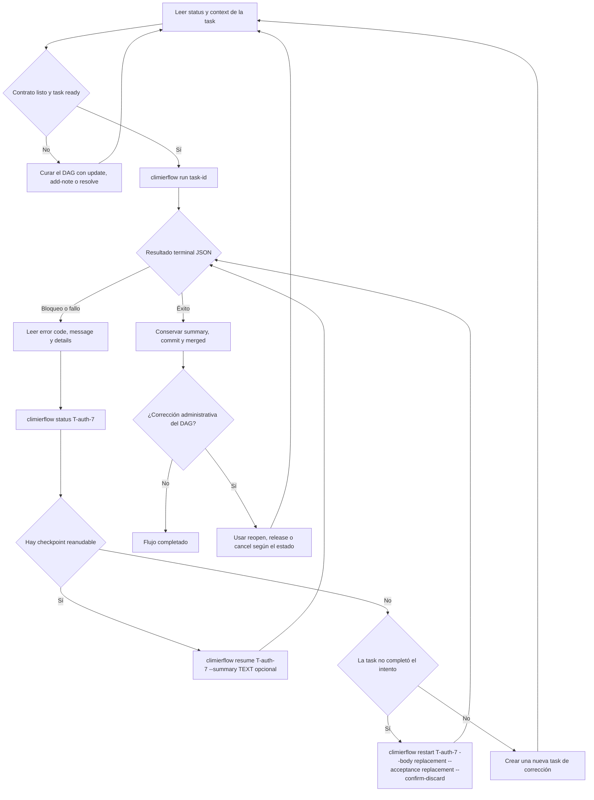

# Flujo de ejecución de tasks

Climier mantiene el DAG y sus contratos. `climierflow` es el único entrypoint
operativo para ejecutar una task: posee internamente claim, worktree,
implementación, revisión, lifecycle, commit, merge y limpieza.



Las formas concretas de recuperación son:

```bash
climierflow status <task-id>
climierflow resume <task-id> [--summary TEXT]
climierflow restart <task-id> --body "<replacement body>" --acceptance "<replacement acceptance>" --confirm-discard
```

`--summary` es opcional para `resume`. `restart` exige valores de reemplazo
para `--body` y `--acceptance`, además de `--confirm-discard`. Si el intento ya
está completado y mergeado, el runner devuelve `RESTART_REQUIRES_REVIEW`: no se
debe hacer `reopen` y restart del flujo completado; el trabajo adicional va en
una nueva task de corrección.

La ejecución normal no se reproduce con secuencias manuales de `take`,
`submit`, `accept` o `reject`. Esas transiciones pertenecen al runner. Las
operaciones de Climier siguen disponibles para leer y curar el DAG y para
administración explícita; no sustituyen `climierflow run`, `status`, `resume` ni
`restart`.
