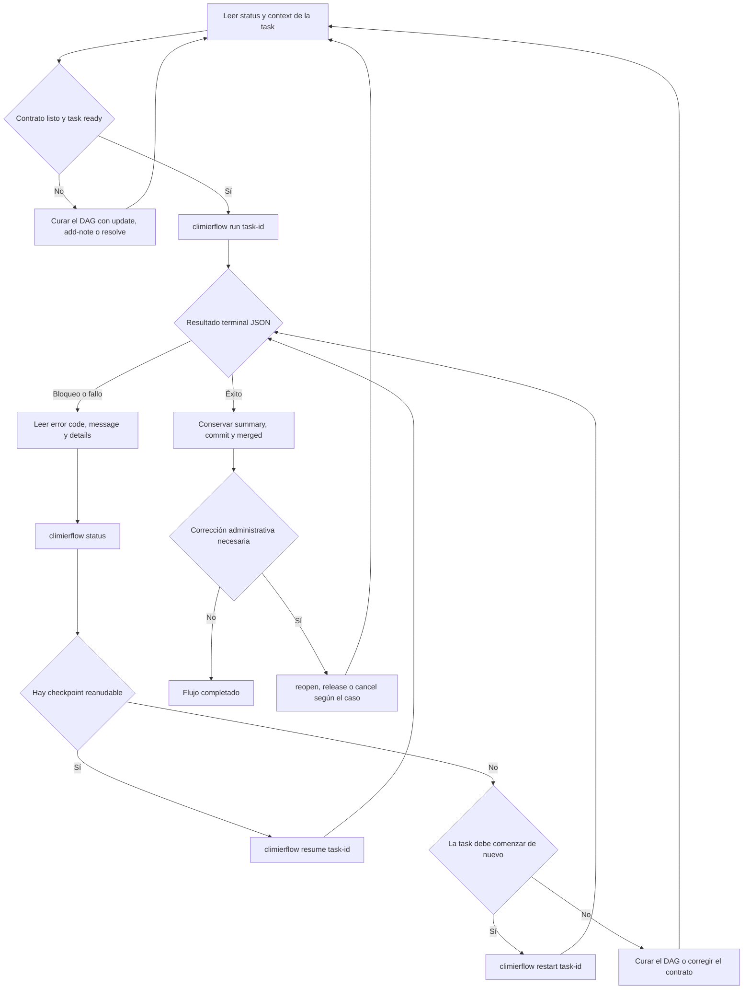

# Flujo de ejecución de tasks

Climier mantiene el DAG y sus contratos. `climierflow` es el único entrypoint
operativo para ejecutar una task: posee internamente claim, worktree,
implementación, revisión, lifecycle, commit, merge y limpieza.

La ejecución normal no se reproduce con secuencias manuales de `take`,
`submit`, `accept` o `reject`. Esas transiciones pertenecen al runner. Las
operaciones de Climier siguen disponibles para leer y curar el DAG y para
administración explícita; no sustituyen `climierflow run`, `status`, `resume` ni
`restart`.
