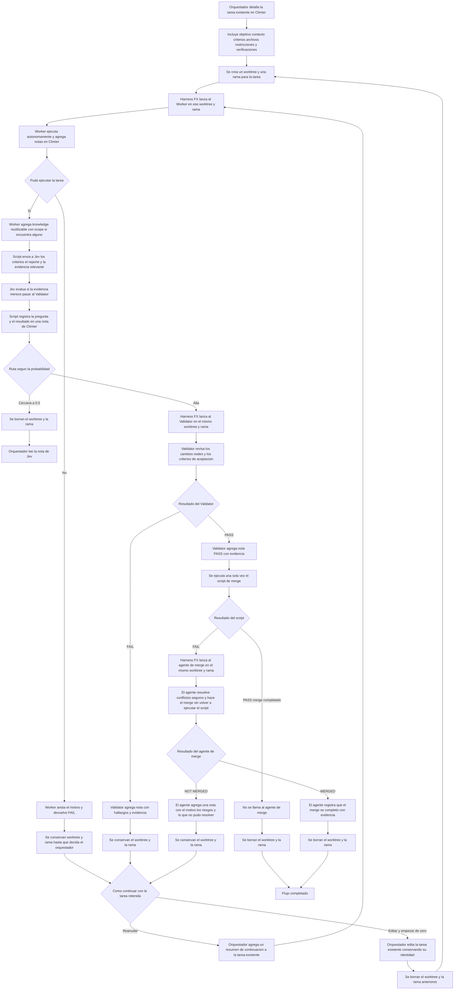

# Flujo de ejecucion de agentes

```mermaid
graph TD
    A[Orquestador detalla la tarea existente en Climier] --> A1[Incluye objetivo contexto criterios archivos restricciones y verificaciones]
    A1 --> B[Se crea un worktree y una rama para la tarea]
    B --> C[Harness FX lanza al Worker en ese worktree y rama]
    C --> D[Worker ejecuta autonomamente y agrega notas en Climier]
    D --> E{Pudo ejecutar la tarea}

    E -->|No| F[Worker anota el motivo y devuelve FAIL]
    F --> G[Se conservan worktree y rama hasta que decida el orquestador]
    G --> REC

    E -->|Si| H[Worker agrega knowledge reutilizable con scope si encuentra alguno]
    H --> I[Script envia a Jev los criterios el reporte y la evidencia relevante]
    I --> J[Jev evalua si la evidencia merece pasar al Validator]
    J --> K[Script registra la pregunta y el resultado en una nota de Climier]
    K --> L{Ruta segun la probabilidad}

    L -->|Alta| VAL[Harness FX lanza al Validator en el mismo worktree y rama]
    L -->|Cercana a 0.5| CLEAN_JEV[Se borran el worktree y la rama]
    CLEAN_JEV --> ORCH_JEV[Orquestador lee la nota de Jev]

    VAL --> REVIEW[Validator revisa los cambios reales y los criterios de aceptacion]
    REVIEW --> RESULT{Resultado del Validator}
    RESULT -->|FAIL| NOTE_FAIL[Validator agrega nota con hallazgos y evidencia]
    NOTE_FAIL --> KEEP_FAIL[Se conservan el worktree y la rama]
    KEEP_FAIL --> REC

    RESULT -->|PASS| NOTE_PASS[Validator agrega nota PASS con evidencia]
    NOTE_PASS --> SCRIPT[Se ejecuta una sola vez el script de merge]
    SCRIPT --> SCRIPT_RESULT{Resultado del script}

    SCRIPT_RESULT -->|PASS merge completado| SCRIPT_OK[No se llama al agente de merge]
    SCRIPT_OK --> CLEAN_OK[Se borran el worktree y la rama]
    CLEAN_OK --> DONE[Flujo completado]

    SCRIPT_RESULT -->|FAIL| MERGE_AGENT[Harness FX lanza al agente de merge en el mismo worktree y rama]
    MERGE_AGENT --> MERGE_WORK[El agente resuelve conflictos seguros y hace el merge sin volver a ejecutar el script]
    MERGE_WORK --> MERGE_RESULT{Resultado del agente de merge}

    MERGE_RESULT -->|MERGED| MERGE_OK[El agente registra que el merge se completo con evidencia]
    MERGE_OK --> CLEAN_AGENT[Se borran el worktree y la rama]
    CLEAN_AGENT --> DONE

    MERGE_RESULT -->|NOT MERGED| MERGE_FAIL[El agente agrega una nota con el motivo los riesgos y lo que no pudo resolver]
    MERGE_FAIL --> KEEP_MERGE[Se conservan el worktree y la rama]
    KEEP_MERGE --> REC

    REC{Como continuar con la tarea retenida}
    REC -->|Reanudar| SUMMARY[Orquestador agrega un resumen de continuacion a la tarea existente]
    SUMMARY --> C

    REC -->|Editar y empezar de cero| EDIT[Orquestador edita la tarea existente conservando su identidad]
    EDIT --> CLEAN_OLD[Se borran el worktree y la rama anteriores]
    CLEAN_OLD --> B
```
