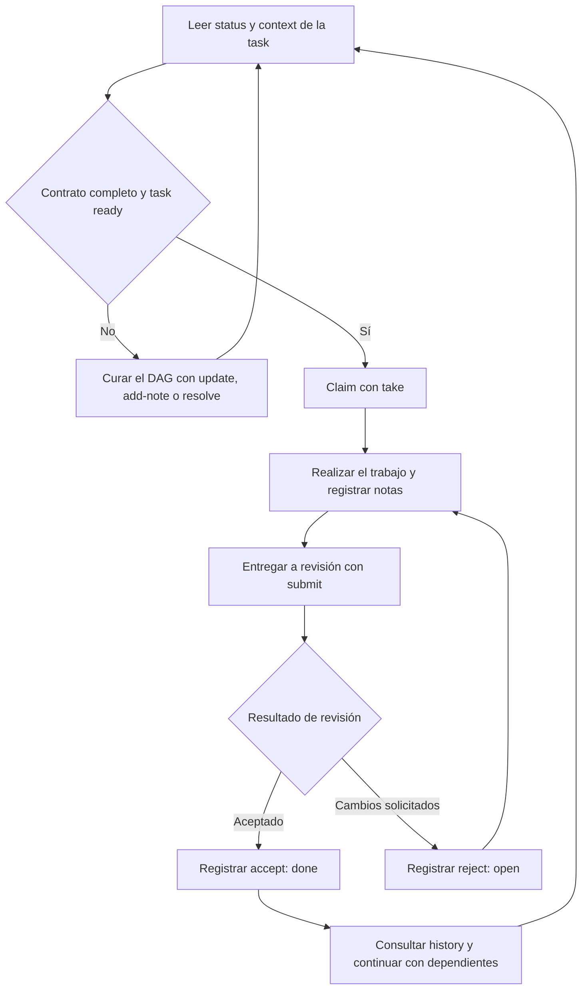

# Flujo del ciclo de vida de una task

Climier registra el estado compartido del trabajo, sus dependencias y sus resultados de revisión. Las personas y herramientas que realizan el trabajo usan los comandos de Climier para reflejar ownership y avances en el DAG.



Comandos habituales:

```bash
climier status
climier context <task-id>
climier take <task-id> --as <agent>
climier add-note <task-id> "Progress update" --as <agent>
climier submit <task-id> --note "Implementation complete" --as <agent>
climier accept <task-id> --as <reviewer>
```

`reject` devuelve el trabajo enviado a `open` y requiere un motivo. `release`, `reopen` y `cancel` son operaciones administrativas explícitas. Las claims se serializan bajo el lock del proyecto y cada cambio se registra en el log de auditoría.
